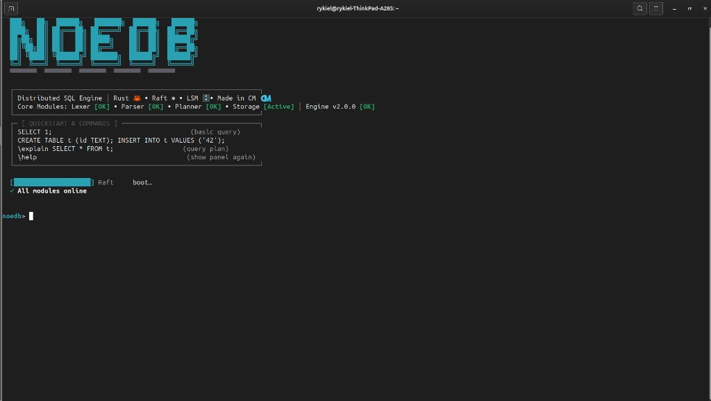

<div align="center">

<p align="center">
  
</p>

# NoeDB

**Sovereign distributed SQL database engine, written in Rust.**

Auditable line by line · Zero mandatory cloud dependency · Security by default

[](https://github.com/toriyama237/NoeDB/actions/workflows/ci.yml)
[](https://github.com/toriyama237/NoeDB/actions/workflows/audit.yml)
[](https://github.com/toriyama237/NoeDB/actions/workflows/codeql.yml)
[](https://www.rust-lang.org)
[](https://www.rust-lang.org)
[](#license)
[](Cargo.toml)

[Quickstart](#quickstart) · [Architecture](#architecture) · [Security](#security-model) ·
[Benchmarks](#validated-at-scale) · [Docs](https://toriyama237.github.io/NoeDB/) · [Contributing](#contributing)

</div>

---

## Why NoeDB

Organizations subject to data-sovereignty requirements — banks, public agencies,
healthcare, defense — need a database they can **audit, embed, and operate**
without a foreign cloud dependency or an opaque binary blob. NoeDB is built for
that mandate:

| Requirement | NoeDB answer |
|---|---|
| **Auditability** | 100 % Rust, `unsafe` forbidden workspace-wide, every layer written in-repo (no `sqlx`, no `sled`, no embedded C) |
| **Sovereignty** | Runs fully on-premises or air-gapped; no telemetry, no license server, no phone-home |
| **Security by default** | mTLS + SPIFFE identity, RBAC + row-level security, at-rest encryption, hash-chained audit log, rate limiting |
| **Durability** | WAL-first LSM storage with CRC-32C on every frame, MVCC snapshots, Raft replication |
| **Traceability** | Conventional-commit history, `--no-ff` feature branches, CHANGELOG under Keep-a-Changelog, signed releases |

## Feature matrix

| Domain | Capabilities |
|---|---|
| **SQL** | `SELECT` / `INSERT` / `UPDATE` / `DELETE`, `INNER` / `LEFT JOIN`, `GROUP BY` / `HAVING`, window functions, CTEs (`WITH RECURSIVE`), subqueries (`IN` / `EXISTS`, correlated), set ops, `CAST`, `EXPLAIN`, `ANALYZE TABLE`, UTF-8 literals |
| **Constraints** | `PRIMARY KEY`, `UNIQUE`, `NOT NULL`, typed columns — enforced atomically before any storage write |
| **Storage** | LSM-tree: WAL segments, MemTable, SSTables (Bloom filters, 4 KiB blocks), leveled compaction, LZ4, CRC-32C |
| **Transactions** | MVCC snapshots, transactional SQL DML, garbage collection safe for latest versions |
| **Distribution** | Raft consensus (election, replication, joint-config membership, snapshots), 3-node in-process simulator, TCP + mTLS transport |
| **Query engine** | Volcano executors, cost-based optimizer (stats via `ANALYZE`), hash/merge/nested-loop joins, hash semi-joins for decorrelated subqueries, predicate & projection pushdown, partial top-k sort, SIMD predicate paths, Rayon parallel scans |
| **Security** | See [Security model](#security-model) |
| **Observability** | Prometheus `/metrics`, Grafana starter dashboard, structured audit export (SIEM-ready TSV) |
| **Ecosystem** | gRPC protocol + connection pool, Python / Go / Node.js clients, interactive REPL (`noedb-cli`), vector K-NN (HNSW) |

## Quickstart

```bash
git clone https://github.com/toriyama237/NoeDB.git
cd NoeDB
cargo test --workspace          # full validation suite
cargo run -p noedb-cli          # interactive REPL
```

Server mode (gRPC + TLS, Prometheus metrics):

```bash
cargo run -p noedb-cli -- --server --data-dir /var/lib/noedb \
    --metrics-listen 127.0.0.1:9090
```

Embedded, as a library:

```rust
use noedb::engine::LocalEngine;

let eng = LocalEngine::open("/var/lib/noedb")?;
eng.execute("CREATE TABLE accounts (id INT PRIMARY KEY, iban TEXT UNIQUE NOT NULL, balance INT NOT NULL)")?;
eng.execute("INSERT INTO accounts VALUES (1, 'FR7630001007941234567890185', 1000)")?;
let rows = eng.execute("SELECT iban, balance FROM accounts WHERE balance >= 500")?;
# Ok::<_, noedb::engine::EngineError>(())
```

Distributed (3-node Raft):

```rust
use noedb::engine::DistributedEngine;

let cluster = DistributedEngine::new_voters(3)?;
cluster.tick(80)?;
cluster.execute("CREATE TABLE t (id INT PRIMARY KEY)")?;
# Ok::<_, noedb::engine::EngineError>(())
```

## Architecture

```text
   ┌──────────┐   ┌──────────┐   ┌──────────────┐   ┌────────────┐   ┌───────────┐
   │   SQL    │   │  Lexer   │   │   Parser     │   │   Query    │   │   Raft    │
   │   text   │──▶│ (tokens) │──▶│    (AST)     │──▶│  Planner   │──▶│ consensus │
   └──────────┘   └──────────┘   └──────────────┘   └────────────┘   └─────┬─────┘
                                                                           │
                                                            ┌──────────────▼──────────────┐
                                                            │   LSM Storage Engine        │
                                                            │  (MemTable ─▶ WAL ─▶ SST)   │
                                                            └─────────────────────────────┘
```

One Cargo crate per box; the dependency graph is enforced by the workspace
(the lexer cannot depend on the planner, the planner cannot depend on Raft):

```text
crates/
├── noedb/            # meta-crate — the public, user-facing API
├── noedb-lexer/      # zero-copy tokenizer, byte-precise spans
├── noedb-ast/        # typed AST, SQL Display round-trip
├── noedb-parser/     # recursive descent + Pratt precedence
├── noedb-planner/    # logical/physical plans, cost-based optimizer, executors
├── noedb-storage/    # LSM-tree: WAL, MemTable, SSTables, compaction, MVCC
├── noedb-txn/        # transaction control
├── noedb-raft/       # Raft consensus core + transport
├── noedb-engine/     # SQL → security → planner → Raft → LSM orchestration
├── noedb-protocol/   # authenticated framed RPC
├── noedb-tls/        # mTLS, SPIFFE identity
├── noedb-grpc/       # gRPC service + auth guard
├── noedb-pool/       # client connection pool, health checks
├── noedb-metrics/    # Prometheus registry
└── noedb-cli/        # REPL + server binary
```

Full design docs: [mdBook](https://toriyama237.github.io/NoeDB/) ·
[`book/src/`](book/src/) (architecture, storage, Raft, query engine,
banking tutorial, observability).

## Security model

Hostile input is the default assumption. Defenses are enforced at the query
boundary, not bolted on:

| Threat | Defense | Where |
|--------|---------|-------|
| SQL injection via stacked queries | multi-statement batches rejected pre-parse | `security.rs` |
| Privilege abuse | DDL / RLS / policy changes gated to admin roles; `SET ROLE` escalation blocked | `security.rs` |
| Audit tampering | append-only log, SHA-256 hash chain, `--audit-verify` | `audit.rs` |
| Credential leakage in logs | secret literals masked before audit write | `redact.rs` |
| Query-flood / DoS | per-session token-bucket rate limiter + statement deadlines | `ratelimit.rs` |
| Data theft from disk/backups | at-rest encryption (XChaCha20-Poly1305, per-record nonce, cell-bound AAD) | `crypto.rs` |
| Brute-forced cluster auth | per-IP failure tracking with temporary ban | `noedb-grpc/auth_guard.rs` |
| Impersonation on the wire | mTLS with mandatory SPIFFE CN enforcement | `noedb-tls/spiffe.rs` |

```bash
# Verify the audit chain, then export for a SIEM
noedb --data /var/lib/noedb --audit-verify
noedb --data /var/lib/noedb --audit-export > audit.tsv

# At-rest encryption and per-session limits
export NOEDB_DATA_KEY="$(openssl rand -hex 32)"
export NOEDB_QPS=2000 NOEDB_STMT_TIMEOUT_MS=5000
```

Vulnerability reports: [private disclosure](https://github.com/toriyama237/NoeDB/security/advisories/new)
— policy in [SECURITY.md](./SECURITY.md).

## Validated at scale

NoeDB ships an end-to-end audit binary that simulates a multinational bank —
**80 agencies, 22 departments, 50 009 employees, 50 009 payslips** — and runs
20 business SQL benchmarks plus constraint checks:

```bash
cargo run --release -p noedb-engine --example national_hr_audit
```

Latest run (release build, commodity hardware):

| Metric | Result |
|---|---|
| Bulk load (100 k rows / 700 k cells) | **7.5 s** |
| 20 business queries (joins, aggregates, CTEs, subqueries) | **22 / 22 PASS** |
| Correlated `NOT EXISTS` on 50 k × 50 k | 329 s → **3.5 s** (hash semi-join) |
| `IN (SELECT …)` on 50 k rows | 221 s → **2.8 s** |
| Full workspace test suite | **316 tests, 0 failures** |

Micro-benchmarks (Criterion): `cargo bench -p noedb-lexer --bench lexer`
(~1 M tokens / 21 ms), `cargo bench -p noedb-storage --bench lsm`,
`cargo bench -p noedb-engine --bench tpch_lite` (TPC-H lite analytical suite).

## Engineering standards

Every merge to `main` satisfies:

```bash
cargo fmt --all -- --check                                # formatting
cargo clippy --workspace --all-targets -- -D warnings     # zero warnings, pedantic on
cargo test --workspace                                    # full suite
cargo doc --no-deps                                       # documented public API
```

- `unsafe_code = "forbid"` — workspace-wide, no exceptions.
- `missing_docs = "warn"` — public API is documented.
- Supply chain: `cargo-deny` (licenses, advisories), `cargo audit`, CodeQL, typos check in CI.
- Git: feature branches, [Conventional Commits](https://www.conventionalcommits.org/),
  `--no-ff` merges — see [`docs/git-workflow.md`](docs/git-workflow.md).
- Releases: [SemVer](https://semver.org), [Keep a Changelog](https://keepachangelog.com) — see [CHANGELOG.md](CHANGELOG.md).

## Roadmap

| Milestone | Theme | Status |
|---|---|---|
| v0.x – v1.x | Lexer → parser → LSM → planner → Raft → engine | ✅ shipped |
| **v2.0** | Query engine v2, observability, clients, docs | ✅ shipped |
| **v2.1** | Planner performance (hash semi-join, top-k), UTF-8 SQL, audit tooling | ✅ shipped |
| v2.2 | Secondary-index join acceleration, aggregate pushdown, prepared-statement cache | 🔜 |
| v3.0 | Online backup/restore, point-in-time recovery, multi-region Raft | planned |

History: [`docs/sprint-plan-v2.md`](docs/sprint-plan-v2.md) ·
[`docs/post-v2-roadmap.md`](docs/post-v2-roadmap.md).

## References

The design stands on published, peer-reviewed foundations:

- Ongaro & Ousterhout (2014), *In Search of an Understandable Consensus Algorithm (Raft)*
- O'Neil et al. (1996), *The Log-Structured Merge-Tree (LSM-Tree)*
- Graefe (1994), *Volcano — An Extensible and Parallel Query Evaluation System*
- Bloom (1970), *Space/Time Trade-offs in Hash Coding with Allowable Errors*
- Selinger et al. (1979), *Access Path Selection in a Relational Database Management System*

## Contributing

Issues, ideas, and PRs are welcome — see [CONTRIBUTING.md](./CONTRIBUTING.md).
Start with [`good first issue`](https://github.com/toriyama237/NoeDB/labels/good%20first%20issue).

## License

Dual-licensed under either of:

- MIT license ([LICENSE-MIT](LICENSE-MIT))
- Apache License, Version 2.0 ([LICENSE-APACHE](LICENSE-APACHE))

at your option.

Unless you explicitly state otherwise, any contribution intentionally submitted
for inclusion in the work by you, as defined in the Apache-2.0 license, shall be
dual-licensed as above, without any additional terms or conditions.
